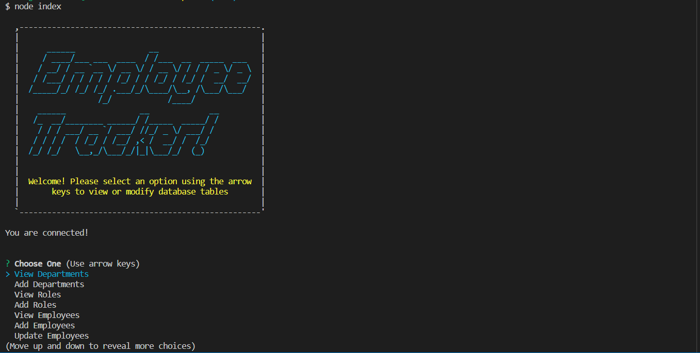
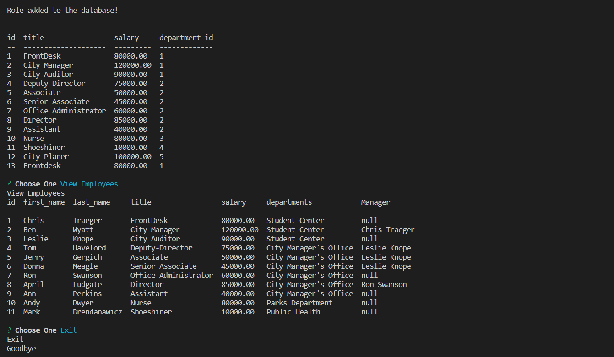

# CMS Employee-tracker
    This application is created for storing employee information, 
    it will allow to add and update an employee roster members.

## Installation
    In the command line of the working directory, istall the follwing npm packages:
          "npm install";
          "mysql";
          "mysql2"
          "Inquirer";
          "console.table";
          "asciiart-logo".

## Mock up
    After you installed all the required npm packages, 
    enter "node index" in the command linde of the working directory

## Walkthrough Video Link
    https://drive.google.com/file/d/11QXbCekhS6Pls4rub5coq45liWPcE4T4/view

